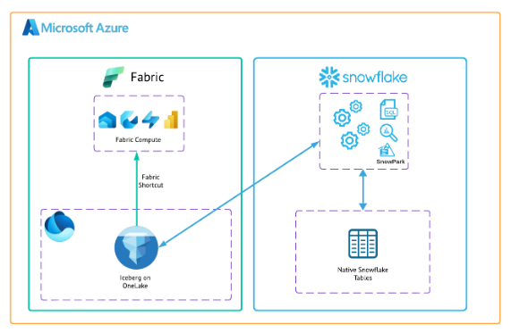

# 1. Overview

**Apache Iceberg** is an open table format for large analytic datasets. It brings **ACID transactions**, schema evolution, time travel, and reliable operations to open data on cloud object storage.  
In this quickstart you will create an **Iceberg table stored in Microsoft Fabric OneLake storage** and confirm that it can be read from **both Snowflake and Fabric**.

## Prerequisites
- Familiarity with **Snowflake** and access to a [Snowflake](https://signup.snowflake.com/?_fsi=4LjRcWEw) account.
- Familiarity with Microsoft Fabric a Fabric workspace with **Lakehouse**.
- Basic understanding of **Apache Iceberg** concepts.

## What You Will Learn
- Creating an **External Volume** that points to OneLake.
- Using sample data in Snowflake to populate a table.
- Creating and populating an **Iceberg table** persisted in OneLake.
- Querying that table from **Snowflake** and **Fabric**.

## What You Will Build
You will create an external volume and an Iceberg table using publicly shared data. The table lives in Iceberg format on **OneLake** and by using Fabric shorcuts can be consumed by Fabric workloads (e.g., Lakehouse and Power BI) as well as Snowflake.

## What You will Need
- A free [Snowflake](https://signup.snowflake.com/?_fsi=4LjRcWEw) Account
- [Fabric Capacity](https://learn.microsoft.com/en-us/fabric/fundamentals/fabric-trial?_fsi=4LjRcWEw) **Important:** Must be in same region as your Snowflake Account
- For simplicity it is best if both platforms have access to the public internet and are not in a virtual network.

Below the end-to-end architecture reference:

> Continue to **[2. Prepare Sample Data](02-prepare-sample-data.md)**.
