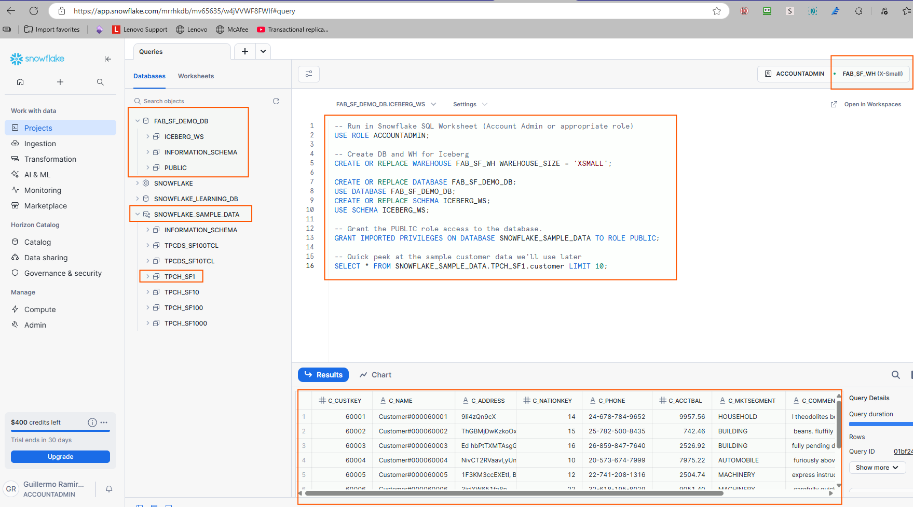

# 2. Prepare Sample Data

We will use the built‑in data share available in your account to keep things simple. For example in our case is: `SFC_SAMPLES_AZWESTUS2.SAMPLE_DATA`
 **Your share name might be different depending on your Snowflake Region**

- The first step is to create a database and warehouse in the Snowflake environment.
- Then we will take sample data from a built-in Snowflake public share in the Data Cloud.
- Let's run the following code statement by statement

> Replace your names as needed, but the workshop uses the following objects:
> - Warehouse: `FAB_SF_WH`
> - Database: `FAB_SF_DEMO_DB`
> - Schema: `ICEBERG_WS`

```sql
-- Run in Snowflake SQL Worksheet (Account Admin or appropriate role)
USE ROLE ACCOUNTADMIN;

-- Create DB and WH for Iceberg
CREATE OR REPLACE WAREHOUSE FAB_SF_WH WAREHOUSE_SIZE = 'XSMALL';

CREATE OR REPLACE DATABASE FAB_SF_DEMO_DB;
USE DATABASE FAB_SF_DEMO_DB;
CREATE OR REPLACE SCHEMA ICEBERG_WS;
USE SCHEMA ICEBERG_WS;

-- Let's use the `SNOWFLAKE_SAMPLE_DATA` database from the built-in share . First grant the `PUBLIC` role access to the sample database.
GRANT IMPORTED PRIVILEGES ON DATABASE SNOWFLAKE_SAMPLE_DATA TO ROLE PUBLIC;

-- Quick peek at the sample customer data we'll use later
SELECT * FROM SNOWFLAKE_SAMPLE_DATA.TPCH_SF1.customer LIMIT 10;
```



> Continue to **[3. Create an Iceberg table in OneLake](03-create-iceberg-table-in-onelake.md)**.
