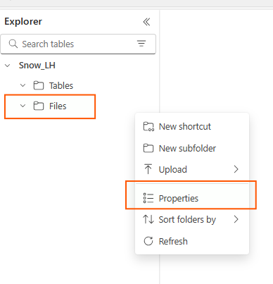

# 3. Create an Iceberg Table in OneLake

In this step you will **(a) create an External Volume** that points to your Fabric OneLake path, **(b) enabling permissions** for Snowflake to access our Fabric Workspace and **(c) create an Iceberg table** stored there.

### A) Create External Volume (points to OneLake)

Before creating an Iceberg table, we must have an external volume. An external volume is one Snowflake object that stores information about your cloud storage locations, and identity and access management (IAM) entities (in this case, our Entra ID Tenant). Snowflake uses the external volume to establish a connection with our cloud storage in order to access Iceberg metadata and Parquet data.

We will need the OneLake Base URL. To find this in Fabric UI:

Update the placeholders for your **Fabric Workspace**, **Lakehouse** and **Tenant ID**.

- Go into an existing Fabric Workspace/create a new one.
- Create a New Item.
- Select Lakehouse and name it "Snow_LH".
- In the Explorer, click the elipses next to Files and then Properties.
- In the Properties Menu, copy the URL.
  **Note:** You will replace the https:// from the URL with the prefix azure:// in the SQL below for creating the volume in Snowflake




Also, we will require the Azure Tenant ID. We can find this easily in the Fabric UI:

- In the upper right corner click on the `?` for help & support.
- At the bottom click `About Fabric` (note: this might say About Fabric or PBI depending on which workload is open).
- Copy the **Tenant URL**. The Tenant ID is the **UUID** that follows `ctid=`


Now, with these values let's create the external volume in Snowflake. Just replace the below parameters with your details

```sql
CREATE OR REPLACE EXTERNAL VOLUME FabricExtVol
  STORAGE_LOCATIONS =
    (
      (
        NAME = 'FabricExtVol'
        STORAGE_PROVIDER = 'AZURE'
        STORAGE_BASE_URL = 'azure://onelake.dfs.fabric.microsoft.com/<FabricWorkspaceName>>/<FabricLakehouseName>.Lakehouse/Files/'
        AZURE_TENANT_ID = '<Tenant ID>'
      )
    );

```


---

### B) Enable permissions to Snowflake in Microsoft Fabric

Now the next step is to ensure Snowflake can access our Microsoft Fabric Workspace

Let's run the following command in Snowflake and take note of the following values:

`AZURE_MULTI_TENANT_APP_NAME` --> In the json inside the `property_value` column, let's copy this value. This is the value corresponding to the Service Principal that Snowflake uses to connect to Azure (we can remove the underscore and numbers ad the very end).
`AZURE_CONSENT_URL` --> Let's take note also of this value

```sql
DESC EXTERNAL VOLUME <your_ext_volume_name>;
```


The output of above command returns the AZURE_CONSENT_URL and AZURE_MULTI_TENANT_APP_NAME properties. Take note of both values. The Azure multitenant app name looks like <name>_<number>, but you only need to capture the <name> portion.

Open the consent URL from the previous step in a new browser tab, if you haven't done this previously. If you would like to proceed, consent to the required application permissions, if prompted. You may be redirected to the main Snowflake website.


Now let's grant this service principal access to the Fabric Lakehouse we created earlier:

- From **Fabric settings** :gear: --> **Admin Portal** --> **Tenant Settings** --> **Developer Settings** : Enable the option `Service Principals can call Fabric public APIs`


- Open the Workspace we created earlier, click **Manage access** and then click **Add people or groups**
- Search for the service principal that we copied from Snowflake
- Add the service principal as a **Contributor**


### C) Create the Iceberg Table

```sql
USE DATABASE FAB_SF_DEMO_DB;
USE SCHEMA ICEBERG_WS;

CREATE OR REPLACE ICEBERG TABLE WS_DIM_CUSTOMER (
    C_CUSTKEY     STRING,
    C_NAME        STRING,
    C_ADDRESS     STRING,
    C_NATIONKEY   STRING,
    C_PHONE       STRING,
    C_ACCTBAL     STRING,
    C_MKTSEGMENT  STRING,
    C_COMMENT     STRING
)
EXTERNAL_VOLUME = 'EXVOL_ONELAKE_WS'
CATALOG = snowflake
BASE_LOCATION = 'ws_dim_customer';

-- Load a small sample from TPCH_SF1.CUSTOMER
INSERT INTO WS_DIM_CUSTOMER
  SELECT TOP 500 *
  FROM SNOWFLAKE_SAMPLE_DATA.TPCH_SF1.CUSTOMER;

-- Verify in Snowflake
SELECT COUNT(*) AS rowcount FROM WS_DIM_CUSTOMER;
SELECT * FROM WS_DIM_CUSTOMER LIMIT 10;
```

> Continue to **[4. Accessing the Data in Fabric](04-accessing-the-data-in-fabric.md)**.
