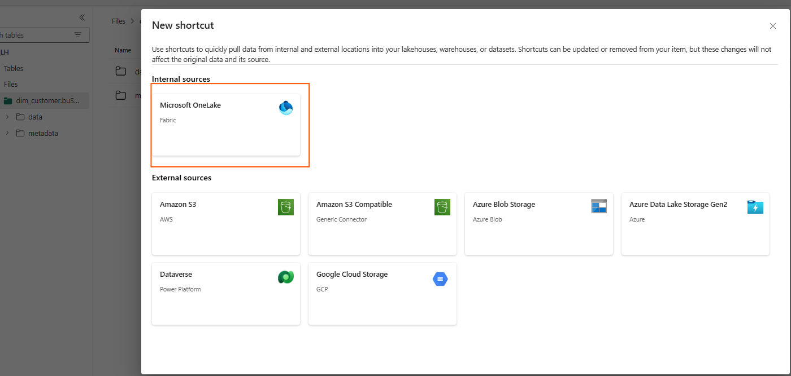
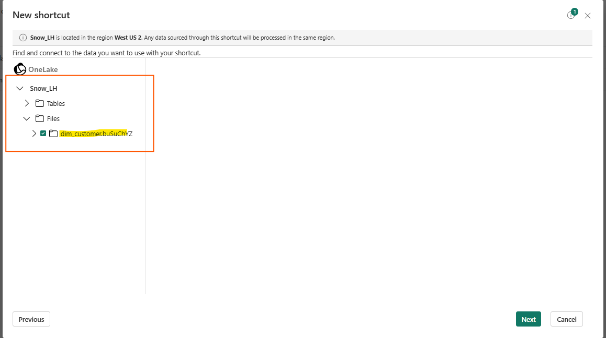
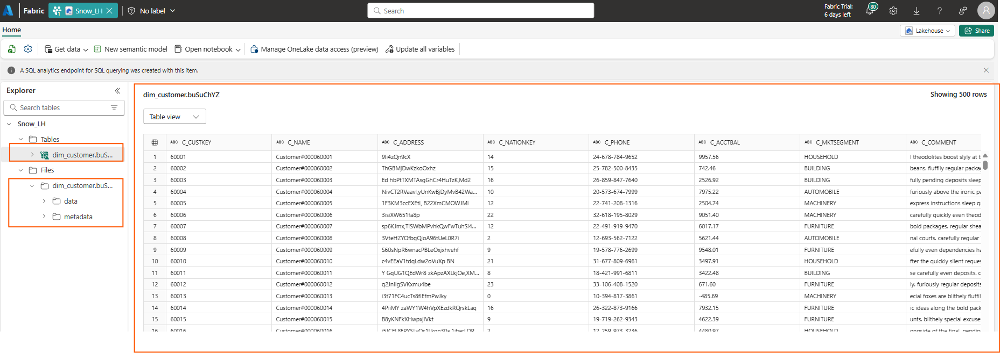
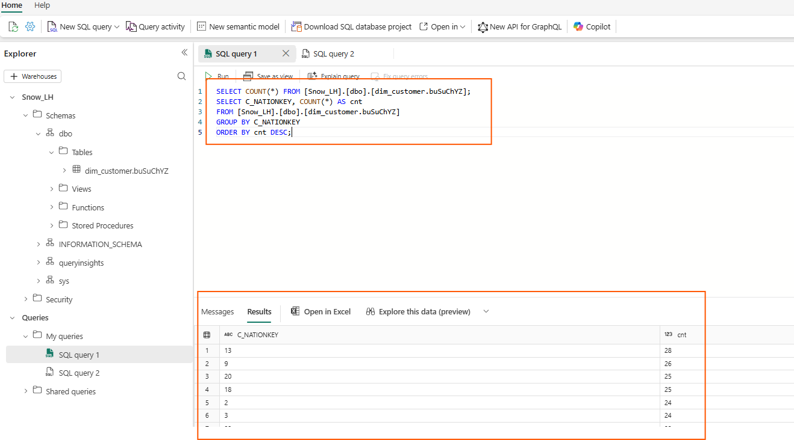
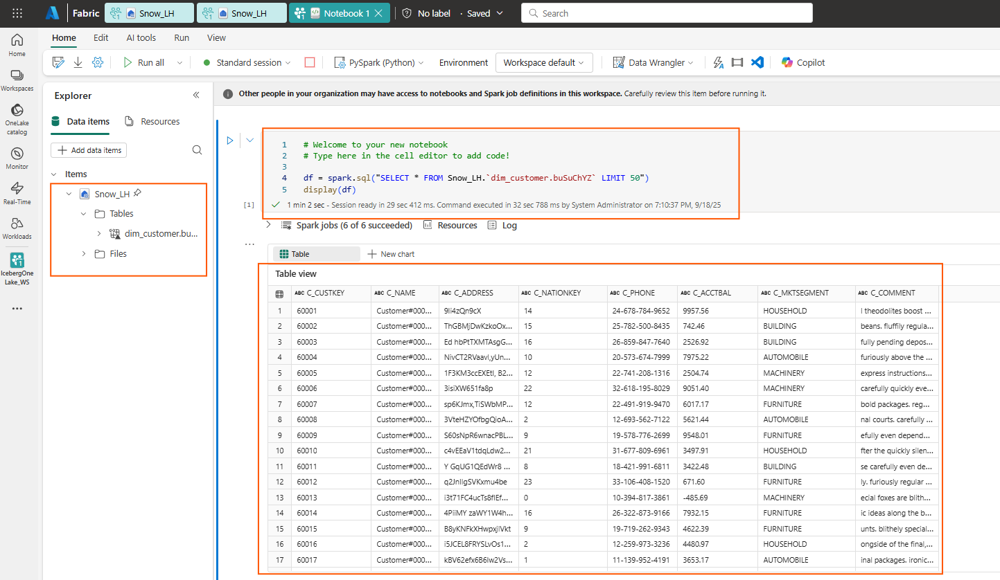

# 4. Accessing the Data in Fabric

Now that the Iceberg table lives in **OneLake**, we can expose it to a **Fabric Lakehouse** using a **Table Shortcut**.

### Create a Table Shortcut
1. Open the **Lakehouse** in your Fabric workspace.
2. In the **Tables** menu (...) --> select **New shorcut**.
3. Select **Microsoft One Lake**
4. Navigate the Lakehouse --> folder structure and select the checkbox next to your Iceberg table folder to select it as the shortcut target location. **Do not select** the checkboxes for "data" or "metadata" subfolders.
5. Click **Next** and **Create** your shortcut. *If you get an error, retry*





Voila! We have now our shortcut available and we can see a preview of the records from the Snowflake Iceberg table in Fabric




### Validate from Fabric
Let's also validate this with our Fabric Spark & TSQL engine to query Iceberg tables. We can use a Notebook or SQL endpoint in Fabric to query the shortcut:
(replace with your object's name)
```sql
SELECT COUNT(*) FROM [Snow_LH].[dbo].[dim_customer.buSuChYZ];
SELECT C_NATIONKEY, COUNT(*) AS cnt
FROM [Snow_LH].[dbo].[dim_customer.buSuChYZ]
GROUP BY C_NATIONKEY
ORDER BY cnt DESC;
```


From a Notebook.. (replace with your object's name)

```python
df = spark.sql("SELECT * FROM Snow_LH.`dim_customer.buSuChYZ` LIMIT 50")
display(df)
```




You have now validated **bi‑directional access**: Snowflake wrote data in Iceberg on OneLake storage, and Fabric read it via a shortcut and enable advanced analytic scenarios like creating Power BI semantic models or feed Fabric Data Aagents.
  
> Continue to **[5. Conclusion and Resources](05-conclusion-and-resources.md)**.
