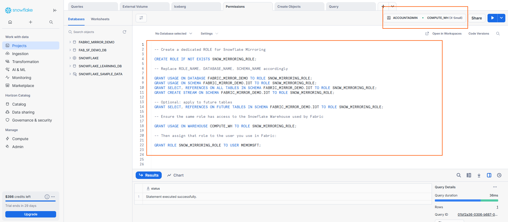

## Step 1: Snowflake Permissions (Required)

Before starting the mirroring setup, ensure the Snowflake user or role you will use has the following permissions:

- `USAGE` on the **DATABASE** and **SCHEMA** containing the data to mirror  
- `SELECT` on all **tables** you plan to mirror  
- `SHOW TABLES` for schema discovery  
- `DESCRIBE TABLE` to read metadata  
- `CREATE STREAM` on the schema or tables (required for change tracking / CDC)

> **💡 Note:** Without these privileges, Fabric cannot complete the initial snapshot or track incremental changes.

### Example Role & Privilege Setup

```sql

-- Create a dedicated ROLE for Snowflake Mirroring 

CREATE ROLE IF NOT EXISTS <ROLE_NAME>;

-- Replace ROLE_NAME, DATABASE_NAME, SCHEMA_NAME accordingly

GRANT USAGE ON DATABASE <DATABASE_NAME> TO ROLE <ROLE_NAME>;
GRANT USAGE ON SCHEMA <DATABASE_NAME.SCHEMA_NAME> TO ROLE <ROLE_NAME>;
GRANT SELECT, REFERENCES ON ALL TABLES IN SCHEMA <DATABASE_NAME.SCHEMA_NAME> TO ROLE <ROLE_NAME>;
GRANT CREATE STREAM ON SCHEMA <DATABASE_NAME.SCHEMA_NAME> TO ROLE <ROLE_NAME>;

-- Optional: apply to future tables
GRANT SELECT, REFERENCES ON FUTURE TABLES IN SCHEMA <DATABASE_NAME.SCHEMA_NAME> TO ROLE <ROLE_NAME>;

-- Ensure the same role has access to the Snowflake Warehouse used by Fabric

GRANT USAGE ON WAREHOUSE <SNOW_WAREHOUSE> TO ROLE <ROLE_NAME>;

-- Then assign that role to the user you use in Fabric:

GRANT ROLE <ROLE_NAME> TO USER <USER_FOR_MIRRORING>;

```

 

## 💡IMPORTANT

**Snowflake Ownership Requirement**

In Snowflake, **ownership** is a critical concept for database objects. If the database or schema you want to replicate has ownership assigned to the **ACCOUNTADMIN** role (which is common when objects are created by administrators), you must transfer or share the ownership with the role that will be used for replication.

**Why is this needed?**

Even if your replication role has `SELECT`, `CREATE STREAM`, and other necessary privileges, certain streaming and mirroring operations may fail if the role doesn't have ownership of the schema and tables.

**Solution: Transfer Ownership**

Run the following commands to transfer ownership to your mirroring role while preserving existing grants. (Only if the database object to replicate does not have ownership on the source table)

```sql
USE ROLE ACCOUNTADMIN;

-- Transfer schema ownership to the mirroring role
GRANT OWNERSHIP ON SCHEMA <DATABASE_NAME.SCHEMA_NAME> 
TO ROLE <ROLE_NAME> 
COPY CURRENT GRANTS;
```

**Snowflake Default Role**

Other important note is that you should change the `default role` for your user so that it uses the role for mirroring. That way the connection is going to authenticate and then inherit this role to replicate the data. Usually account admin is the default role.

```sql
ALTER USER <USER FOR MIRRORING> SET DEFAULT_ROLE = <ROLE_NAME>;
```

---
## 🏗 Warehouse Considerations

You can use any warehouse with `USAGE` granted to the role. Default `COMPUTE_WH` is fine. For labs or demos, an `X-SMALL` warehouse is recommended.

**Best Practice for Production:**
Use a dedicated warehouse for Fabric mirroring.
This allows you to:
- Isolate and monitor compute costs separately
- Avoid resource contention with other Snowflake workloads
- Scale warehouse size independently of other workloads
- Apply different auto-suspend/auto-resume settings


 > Continue to **[2.Setup Snowflake](02-setup-snowflake.md)**.
