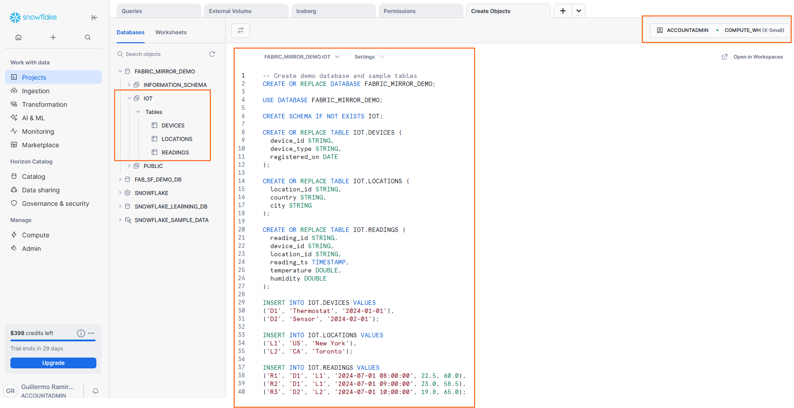
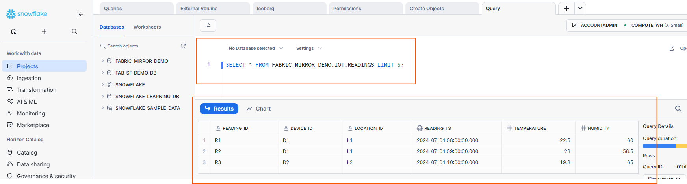

# Step 2: Prepare Sample Data

Run the SQL script contained within this workshop directoyy --> `script/create_iot_demo_db.sql` in a Snowflake Worksheet to create the database, populate tables (replace the placeholders with your values). Make sure to setup permissions on these objects once created, as stated in **[1. Permissions ](01-permissions.md)**





Then once all the objects are created, run the following to validate the data is properly inserted

```sql
-- Validate sample data
SELECT * FROM '<YOUR_DB>'.`YOUR_SCHEMA`.`<YOUR_TABLE>`LIMIT 5;
```




> Continue to **[3. Create mirrored Database ](03-create-mirrored-db.md)**.
