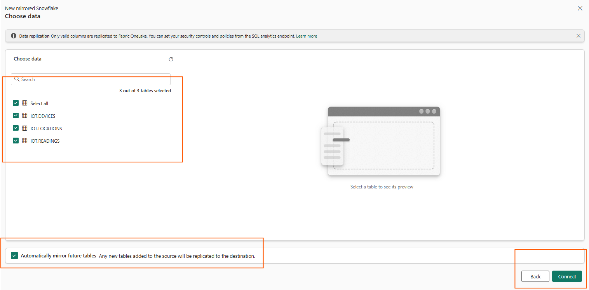
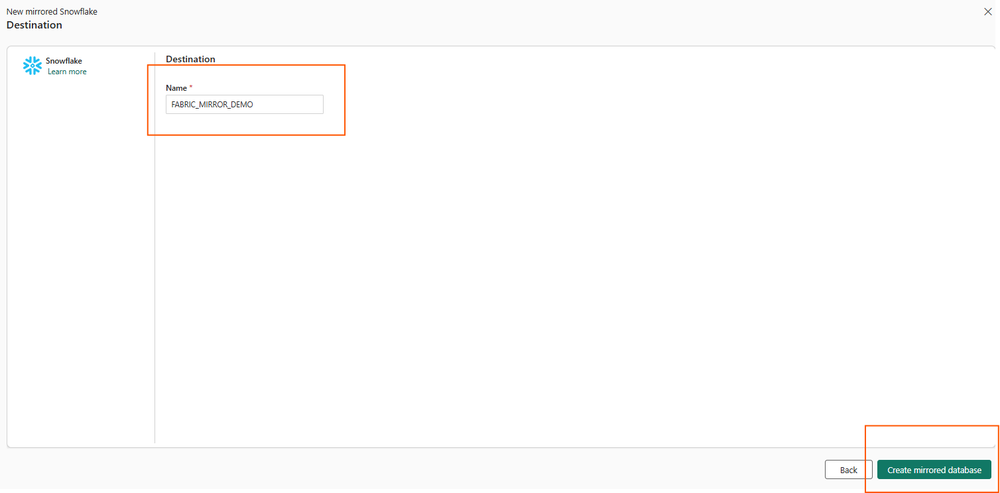
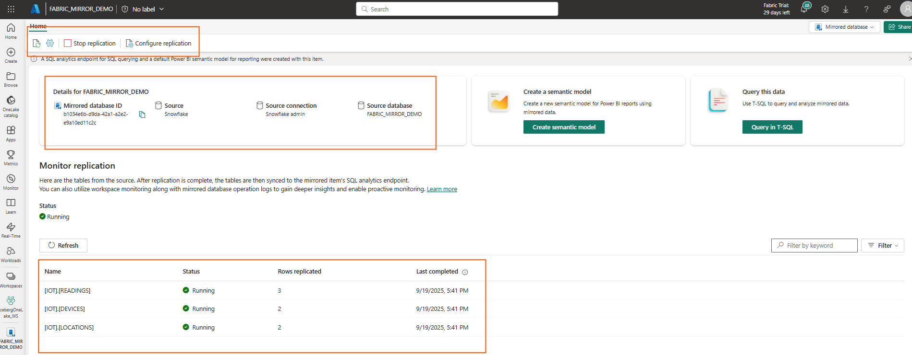

# Step 3: Mirror Snowflake Database in Fabric

1. Go to the target Fabric Workspace → **New Item** → **Mirrored Snowflake**.
2. Select **Snowflake** as the source.

4. Enter the following details in `connection details`:
- **Server:** Navigate to the accounts on the resource menu in Snowflake. Cick on `Account Details` you can copy the server name to the clipboard. 
- **Warehouse:** From the `Compute` section from the resource menu in Snowflake, select `Warehouses`. The warehouse is the Snowflake Warehouse (Compute) and not the database.
4. Enter the following details in `connection credentials`:
- **Connection:** Create new connection.
- **Connection name:** Should be automatically filled out. Change it to a name that you would like to use.
- **Data Gateway:** Select the default (None) or the name of virtual network data gateway or on-premises data gateway, according to your scenario.
- **Authentication kind:** Snowflake
- **Username:** Your Snowflake username that you created to sign into Snowflake.com.
- **Password:** Your Snowflake password that you created when you created your login information into Snowflake.com.
    Azure Key Vault (Optional)
5. **Privacy Level:** Leave it as is
6. Click **Connect**

  

7. Select the source database for the mirrored object from the list

  

8. Choose the tables to replicate

  
  
9. Select `Create mirrored database`

  

10. Leave the replication process complete. You will see the mirrored databse and the details for the tables and rows. Here we can also manage the replication and configure different settings.

 

Let's query this data to interact with the mirrored data... > Continue to **[4. Validate Query ](04-validate-query.md)**.

