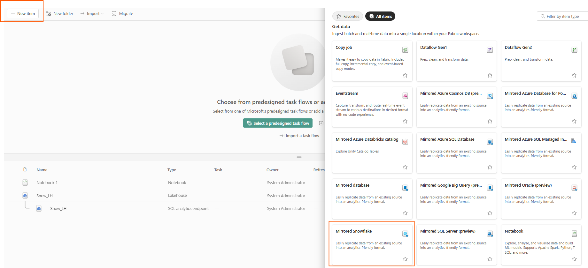
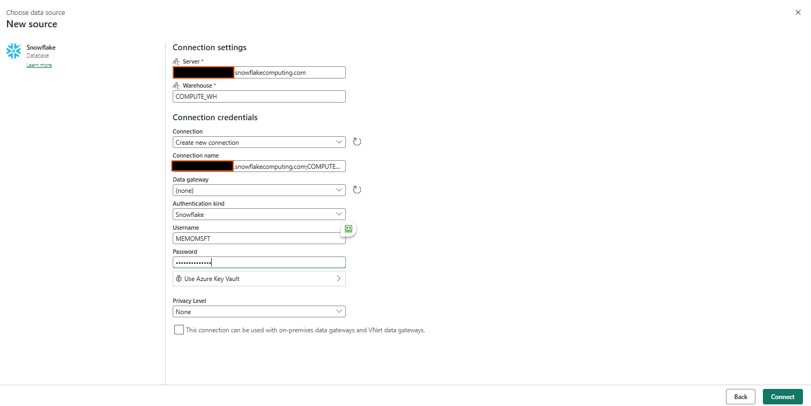
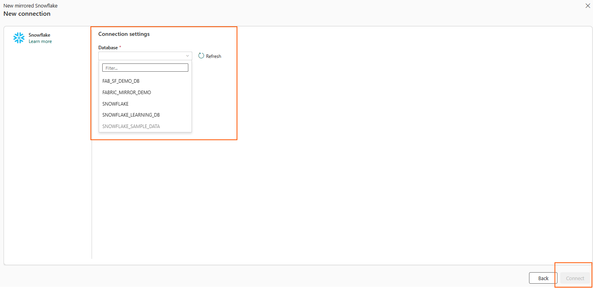

# Step 3: Mirror Snowflake Database in Fabric

1. Go to the target Fabric Workspace → **New Item** → **Mirrored Snowflake**.
2. Select **Snowflake** as the source.

4. Enter the following details in `connection details`:
- **Server:** Navigate to the accounts on the resource menu in Snowflake. Cick on `Account Details` you can copy the server name to the clipboard. 
- **Warehouse:** From the `Compute` section from the resource menu in Snowflake, select `Warehouses`. The warehouse is the Snowflake Warehouse (Compute) and not the database.
4. Enter the following details in `connection credentials`:
- **Connection:** Create new connection.
- **Connection name:** Should be automatically filled out. Change it to a name that you would like to use.
- **Data Gateway:** Select the default (None) or the name of virtual network data gateway or on-premises data gateway, according to your scenario.
- **Authentication kind:** Snowflake
- **Username:** Your Snowflake username that you created to sign into Snowflake.com.
- **Password:** Your Snowflake password that you created when you created your login information into Snowflake.com.
    Azure Key Vault (Optional)
5. **Privacy Level:** Leave it as is
6. Click **Connect**

  

