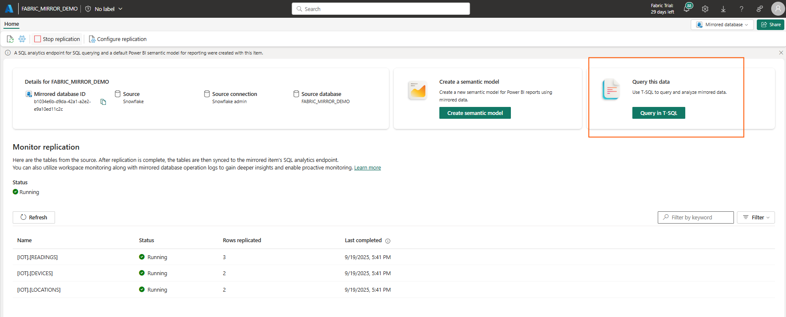
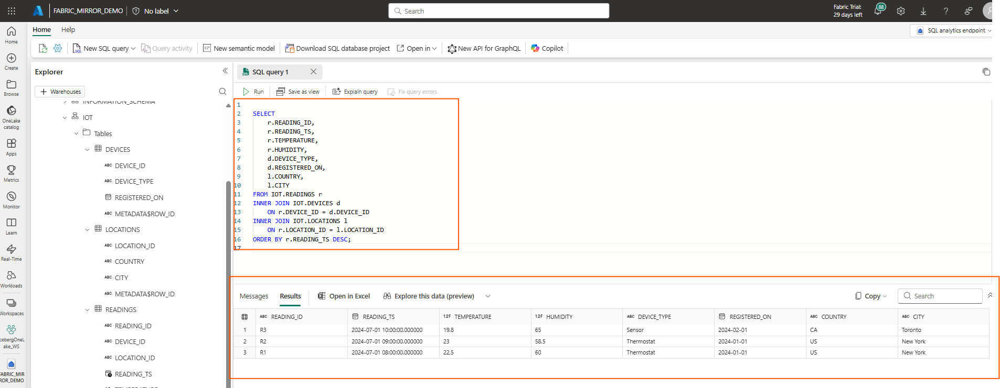
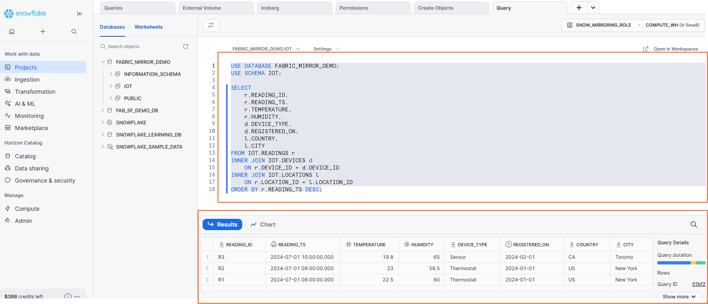

# Step 4: Query and Validate Data

1. Use Fabric SQL Endpoint or a Notebook to query the mirrored tables. In the mirrored database, select `Query in T-SQL`, it will open the SQL Enpoint for the mirrored database




2. Execute a sample query on your data. Here an example (you should modify it as per your tables)
   
```sql
SELECT 
    r.READING_ID,
    r.READING_TS,
    r.TEMPERATURE,
    r.HUMIDITY,
    d.DEVICE_TYPE,
    d.REGISTERED_ON,
    l.COUNTRY,
    l.CITY
FROM IOT.READINGS r
INNER JOIN IOT.DEVICES d
    ON r.DEVICE_ID = d.DEVICE_ID
INNER JOIN IOT.LOCATIONS l
    ON r.LOCATION_ID = l.LOCATION_ID
ORDER BY r.READING_TS DESC;
```



3. If we execute this same query in Snowflake we should get the same result

   


✅ **Expected Result:** You should see the output of Snowflake source data from Fabric.


> Continue to **[5.Resources ](05-resources.md)**.
