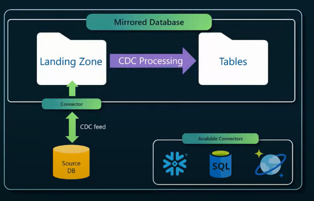

# Snowflake Mirroring in Microsoft Fabric

This workshop demonstrates how to mirror a **custom IoT dataset** from Snowflake into Microsoft Fabric and validate it through SQL Endpoints.

## 📝 Overview
Snowflake Mirroring allows Fabric to read Snowflake data continuously, enabling near real-time analytics in Fabric without building pipelines.

**When to use:**
Mirroring is ideal when you need to keep Fabric in sync with Snowflake without manually copying data or scheduling batch jobs. It works similarly to CDC (Change Data Capture) — tracking changes in Snowflake and streaming them into Fabric — so your analytics stay up to date with minimal latency. This is particularly useful for scenarios like IoT telemetry, financial transactions, or any workload where fresh data is critical for decision-making.

Below the architecture reference for the Database Mirroring:

**What you will learn:**
- Preparing a Snowflake environment (database + sample data)
- Creating a Fabric mirrored database
- Querying mirrored tables in Fabric

## 📦 Prerequisites
- A Snowflake account with access to create databases/tables
- A Microsoft Fabric workspace with Contributor permissions
- Power BI or Fabric SQL Endpoint enabled

## 🚀 Steps
0. [Permissions](00-permissions.md)
1. [Prepare Snowflake Environment](01-prereqs.md)
2. [Create Sample Data in Snowflake](02-setup-snowflake.md)
3. [Mirror the Database in Fabric](03-create-mirrored-db.md)
4. [Query and Validate Data](04-validate-query.md)
5. [Resources](05-resources.md)
---

## ℹ️ Notes

- **Networking & Security:** If Snowflake is private, configure a VNet Data Gateway or On-premises Data Gateway. [Learn more](https://learn.microsoft.com/en-us/fabric/data-factory/securely-connect-to-data)
- **Monitoring:** Use the Fabric Mirroring UI to check sync latency. [Details](https://learn.microsoft.com/en-us/fabric/mirroring/monitoring)
- **Cost & Limits:** Review [official limits](https://learn.microsoft.com/en-us/fabric/mirroring/snowflake#considerations)
- **Troubleshooting:** See [guide](https://learn.microsoft.com/en-us/fabric/mirroring/troubleshooting)
